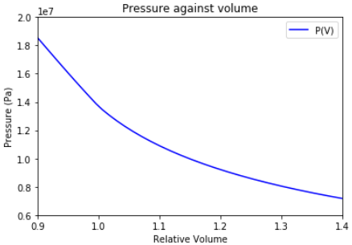

# ENE251

In this repository, you will find the code used to produce a lumping for the oil in the reservoir from which we are producing using EOR operations.

Over Parts A and B, the elements of the project include the followin:

• The coding of a routine for expansion and pseudoization of the compositional description of a reservoir fluid.
• Tuning of the pseudocomponent EOS properties.
• Coding of a mixing-cell algorithm for determining MMP.
• Coding of a corresponding states viscosity routine.

The 2 parts of this project are defined as follows:

-Part A: The objective is to lump the components trying different expansions using Pedersen et al procedure. We then run a CME (constant mass expansion) experiment to determine the Pressure Saturation. We try different EOS in doing so, the SRK (Soave-Redlich-Kwong) and the PR (Peng-Robinson). We also experiment with different options: using binary cofficients or not, different lumpings,...The plots are confronted to the experiment and you can see the results in the figure. An example of a possible lumping and the CME results can be seeing below:

Lumping example:
----------------
|Component | Mole % | Tc (K) |Pc (atm) | omega | MW (g/mol)|
|----------|--------|--------|---------|----------|-----------|
|Hydrogen Sulfide | 0 |  |   |  34.08|
|Carbon Dioxide | 0.44 | 304.2 | 72.9 | 0.228 | 44.01|
|Nitrogen | 0.17 | 126.2 | 33.6 | 0.04 | 28.013 |
|Methane | 34.63 | 190.6 | 45.4 | 0.008 | 16.043 |
|Ethane | 2.63 | 305.4 | 48.2 | 0.098 | 30.07 |
|Propane | 3.35 | 369.8 | 41.9 | 0.152 | 44.097| 
|iso-Butane | 0.92 | 408.1 | 36 | 0.176 | 58.123| 
|n-Butane | 1.75 | 425.2 | 37.5 | 0.193 | 58.123 |
|iso-Pentane | 0.89 | 460.4 | 33.4 |  0.251|  72.15 |
|n-Pentane  | 1.01 | 469.6 | 33.3 | 0.251 | 72.15 |
|Hexanes | 1.52 | 507.4 | 29.3 | 0.296 | 84 |
|C(7-12) | 21.23 | 580.5 | 25.6 | 0.44 | 130|
|C(13-18) | 12.68 | 666.9 | 20.6 | 0.667 | 212.2| 
|C(19-26) | 9.34 | 759.4 | 17.8 | 0.876 | 308 |
|C(27-37)  | 5.78 | 875.1 | 14.2 | 1.0465 | 436.5|
|C(38+) | 3.67 | 1114.1 | 12 | 0.8191 | 722.8 |

Results vs experiment:
----------------------

-PartB: In this part we are going to use the mixing-cell model presented in SPE 116823 paper to develop an algorithm to determine the MMP (Minimum Miscibility Pressure) for different compositions of LPG (Liquifed Petroleum Gas) and CO2. Next, we develop a routine to compute viscosity using LBC correlations and the corresponding states method.

